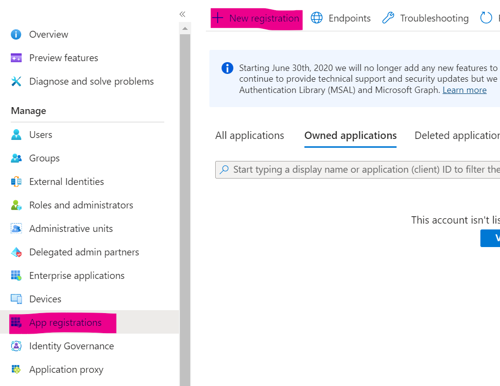
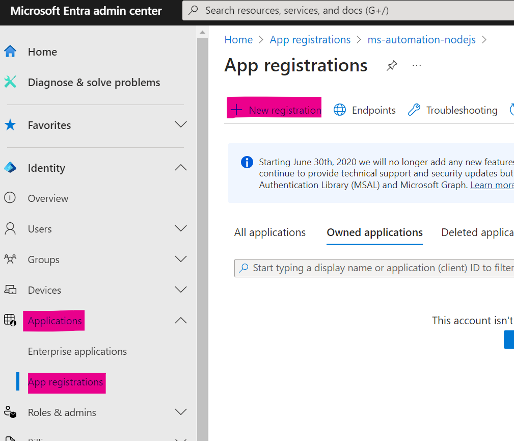
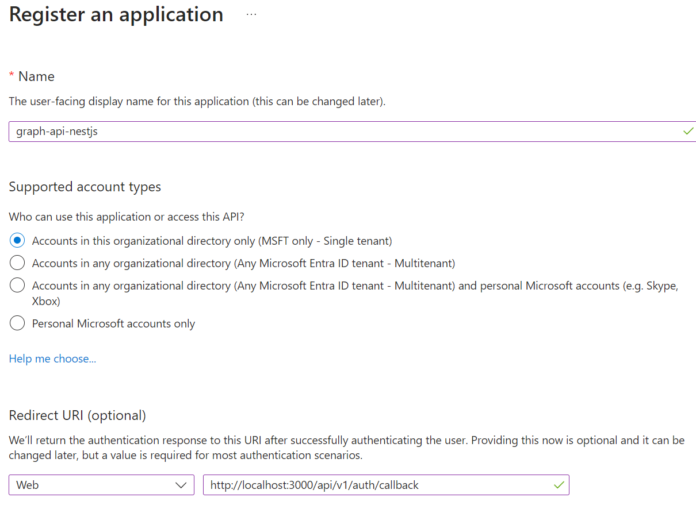
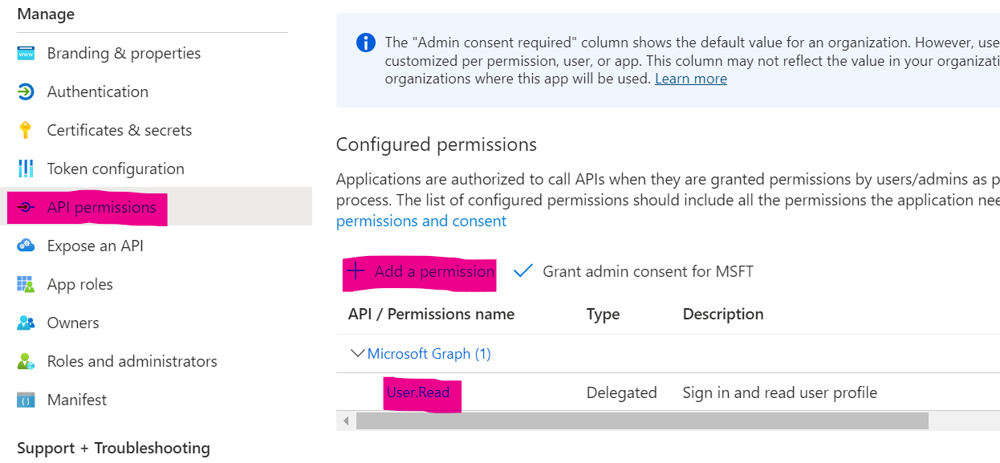
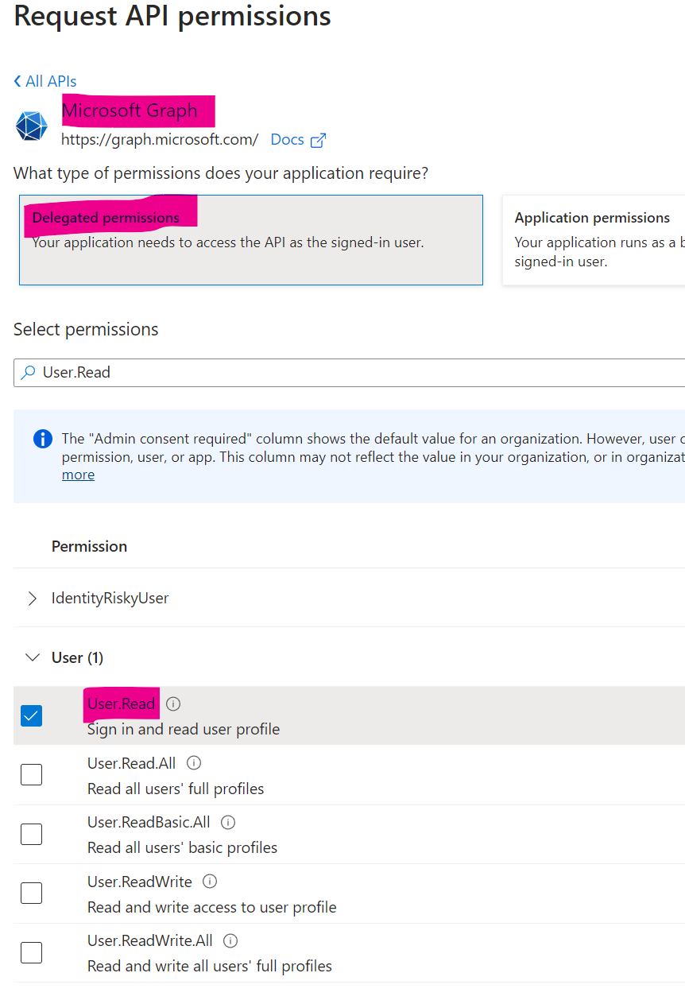
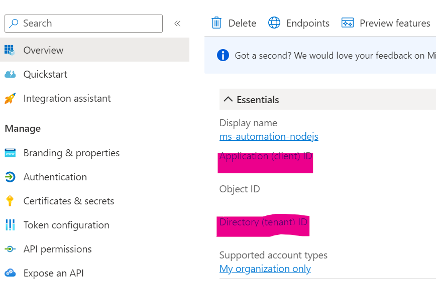

# Write Up of Implementation

This write up isn't a "code as we go" tutorial, instead acts as clone-able codebase that will explain the decisions made and logic being performed.

## Pre-requisites

I'll try to explain what I've done at an almost beginner level for people new to NestJS and OAuth.

I am aiming to fill the gap of knowledge for using NestJS with User Delegated Microsoft Authorization to access MS Graph APIs.

I won't be explaining in-depth concepts for NestJS, TypeScript/JS, Web Development, RESTful APIs, or other information that is easily found on documentation.

## 0. Azure Entra App Registration

If you wish to clone any branches, this section is a requirement.

We need to get the secrets and IDs needed to get user delegated authorization that we can use to call the Microsoft Graph APIs.

### M365 Dev Environment

Sign up for the Microsoft 365 developer environment if you're eligible. You won't have access to Azure directly, but you'll still get access to Entra (Active Directory).
<https://learn.microsoft.com/en-us/office/developer-program/microsoft-365-developer-program-get-started>

Otherwise, use your Azure account, but beware of risks of developing in your production environment.

### App Registration with Microsoft Entra

Start a new App Registration.

Depending whether you're using Azure's Entra or M365 Entra (through Dev environment), the location of the app registration section is different.

### Azure App Registration (Production Environment)

Navigate to [Microsoft Entra ID](https://portal.azure.com/#view/Microsoft_AAD_IAM/ActiveDirectoryMenuBlade/~/RegisteredApps) and find App Registration within side menu.



### M365 Entra (Dev Environment)

Navigate to [Microsoft Entra admin center](https://entra.microsoft.com/#view/Microsoft_AAD_RegisteredApps/ApplicationsListBlade/quickStartType~/null/sourceType/Microsoft_AAD_IAM) and find App registration under Applications dropdown in side menu.



### App Registration

Steps to register an application are the same regardless of M365 Entra or Azure environment.

1. Start a new Registration.
1. Name the application, select the support account type that applies to you. For internal organization use, select the first option. This restricts login access to only this user directory.
1. Enter the Redirect URI `{domain/localhost}/api/v1/auth/callback`. `HTTP` and `localhost` for development, or use `HTTPS` and domain for production.



### App Certifications & Secrets

1. Within App Registration, navigate to Certifications & Secrets then new Client Secret.
1. Enter a name and expiry date.
1. Copy Client Secret, as this is the only time you'll see it.
1. Paste it within your secret management process, for `AZURE_CLIENT_SECRET`.
   See the Secrets section of project [Readme](../../README.md).


### API Permissions - Scope

1. Within the API Permissions section, click Add Permission.
1. Choose Microsoft Graph, then Delegated Permissions.
1. Search and add for each Scope listed within [appConfig.json](../../appConfig.json) file. E.g. `User.Read` etc.
1. Back on the listed Configured Permissions, click Grant admin consent for MSFT.





### Copy Tenant and Client ID

1. Navigate back to Overview page of app registration.
1. Copy the Application (client) ID and Directory (tenant) ID, and save into secrets management for `AZURE_CLIENT_ID` and `AZURE_TENANT_ID`.
   See the Secrets section of project [Readme](../../README.md).



### Generate Secret Key for Session Management

Express-Session requires a secret key to be set. You can read more at the [Express-Session API Documentation](https://www.npmjs.com/package/express-session).

It's recommended to use at least a 32-byte random string (64 characters).

Save this secret within your secrets management for `SESSION_SECRET_KEY`.
See the Secrets section of project [Readme](../../README.md).

### Environment Variables

After the above steps, you should have the following secrets and IDs saved in your method of choice for NestJS secret management. I'm using a `.env.development.local` file.

```env
AZURE_TENANT_ID=xxxxxxxx-xxxx-xxxx-xxxx-xxxxxxxxxxxx
AZURE_CLIENT_ID=xxxxxxx-xxxx-xxxx-xxxx-xxxxxxxxxxxx
AZURE_CLIENT_SECRET=xxxxx~xxxxxxxxxxx~xxxxxxxxxxxxxxxxxxxxxx
AZURE_REDIRECT_URI=http://localhost:3000/api/v1/auth/callback

SESSION_SECRET_KEY={64 character random string as minimum}
```

## 1. Microsoft OAuth2 (MSAL) Flow and Test Graph Call

If you wish to get boilerplate with a working MSAL-Node flow and to get up and running on your own, clone the following branch.

Clone the <#TODO: Get Branch> branch.

### The OAuth2.0 Flow

Now we have Azure Entra app registration configured, we can use it to perform an OAuth2.0 flow.
There are plenty of guides on the internet explaining how OAuth2.0 works, so I won't go into detail.

We're using the MSAL for NodeJS library for OAuth2.0 flow, as it abstracts a lot of the technical details required with an alternative method like Passport.

The basics for how it's implemented within this project are:

1. Use an NestJS AuthGuard to perform a check on a protected endpoint (e.g. /user). This checks the user's session for a token.
1. If no token, raise an UnauthorizedException. This is picked up by a custom NestJS UnauthorizedException filter.
1. Save the original request url (/user) within session.
1. Redirect the user to Microsoft for authorization. This link is built with a standard login with the Tenant ID appended:
   `https://login.microsoftonline.com/AZURE_TENANT_ID`
1. As Entra knows our redirect URI, it sends the client back to that endpoint with the code appended (/auth/callback?code=xxxxx).
1. The Callback endpoint handles the redirection and uses the code to request an access token (handled by MSAL-Node library) along with the Client Secret.
1. The token is saved to the user's session and the original redirection URL is read from session.
1. User is then redirected to their original endpoint (/user).

### Session Management

### Auth Service, Controller, Guard and Module

This isn't a code as you go tutorial. Clone the following branch to get started, as I will be explaining the decisions and logic within the code.

Clone the <#TODO: Get Branch> branch.

#### AuthController

`src/auth/auth.controller`

As per MVC design, I've separated out most logic from Controllers and placed it in Services.

First the AuthService is injected within AuthController:

```ts
@Controller('auth')
export class AuthController {
  constructor(private authService: AuthService) {}
```

The Login route is pretty simple, just gets the microsoft login url from `authService.signIn` and redirects the user to that.

```ts
  @Get('login')
  async login(@Res() res: Response): Promise<void> {
    const loginUrl = await this.authService.signIn();
    res.redirect(loginUrl);
  }
```

The Logout route calls the `authService.signOut` function and awaits the asynchronous process to be fulfilled.

If fulfilled but the status was set to Bad_Request, the user had no token - which we're consider as user is already logged out.
Additional error checking performed incase session had issues destroying token.

```ts
  @Get('logout')
  async logout(@Req() req: Request, @Res() res: Response): Promise<void> {
    await this.authService
      .signOut(req)
      .then((status) => {
        let message = 'Logged out successfully.';

        // If the user token wasn't found, we consider the user not logged in.
        if (status === HttpStatus.BAD_REQUEST) {
          message = 'User not logged in.';
        }

        res.status(status).send({ message: message });
      })
      .catch((error) => {
        const errMessage = 'Error logging out: ' + error.message;
        throw new InternalServerErrorException(errMessage);
      });
  }
```

The Callback route handles the redirection from the Microsoft Authorization flow. The user is redirected here with the code included as a query parameter after successfully logging into Microsoft.

We call the `AuthService.handleRedirect` with the code to perform the exchange for the token and store it in session. The User is then redirected back to their original route.

```ts
  @Get('callback')
  async callback(
    @Req() req: Request,
    @Query('code') code: string,
    @Res() res: Response,
  ): Promise<void> {
    await this.authService.handleRedirect(req, code);

    // Get the original destination URL from the session or return '/'.
    const redirectUrl = await this.authService.getAfterLoginRedirect(req);

    // Delete AfterLoginRedirect from Session. Awaiting for Async process not required.
    this.authService.deleteAfterLoginRedirect(req);

    // Redirect user back to their original destination.
    res.redirect(redirectUrl);
  }
}
```

#### AuthService

`src/auth/auth.service`

AuthService handles the interaction with the MSAL-Node library, as well as session-management.

The following looks messy, but is needed to avoid some TypeScript type errors.

1. First we declare `msalClient` as a ConfidentialClientApplication. This assumes the token handling is kept confidential, e.g. not within a client-side app.
1. As we're using `ConfigService` for receiving environment variables, their types were explicitly set to avoid TypeScript errors. Any use of `infer: true` tells TypeScript to listen to the ConfigService types defined.
1. We can now configure the msalClient.
   1. clientID is read from envs.
   1. authority sets the tenant url for /authorize and /access endpoints used within the OAuth2.0 flow.
   1. clientSecret is used when requesting an access token from a code.
1. Then instantiate the msalClient with the above configuration.

```ts
@Injectable()
export class AuthService {
  // ConfidentialClientApplication is used for WebApp and WebAPI scenarios. See MSAL-Node docs for more info.
  private msalClient: ConfidentialClientApplication;

  constructor(
    // Setting ConfigService to infer environment variables types to prevent TypeScript errors.
    private configService: ConfigService<
      {
        AZURE_CLIENT_ID: string;
        AZURE_TENANT_ID: string;
        AZURE_CLIENT_SECRET: string;
        AZURE_REDIRECT_URI: string;
      },
      true
    >,
  ) {
    const msalConfig: Configuration = {
      auth: {
        clientId: this.configService.get<string>('AZURE_CLIENT_ID', {
          // Infer the type of the environment variable from the types set in constructor. Prevents TypeScript error.
          infer: true,
        }),
        authority: `https://login.microsoftonline.com/${this.configService.get<string>('AZURE_TENANT_ID')}`,
        clientSecret: this.configService.get<string>('AZURE_CLIENT_SECRET', {
          infer: true,
        }),
      },
    };
    this.msalClient = new ConfidentialClientApplication(msalConfig);
  }
```

The `signIn` function uses the `msalClient` to build the OAuth2.0 /authorize link that a user will be redirected to.

```ts
  async signIn(): Promise<string> {
    const authUrlParameters = {
      scopes: appConfig.AZURE_SCOPES,
      redirectUri: this.configService.get<string>('AZURE_REDIRECT_URI', {
        infer: true,
      }),
    };

    return await this.msalClient.getAuthCodeUrl(authUrlParameters);
  }
```

The `handleRedirect` function handles the redirection logic from Microsoft's authorization login.

1. First get the code from the parameter and use this to build out tokenRequest configuration for `msalClient`.
1. `msalClient` then performs the logic to call the OAuth2.0 /access endpoint exchanging the user's code with an access token.
1. Save the accessToken in session.
1. Log the account login attempt information received from OpenID Connect information.
   - _If you wanted to authenticate the user based using OpenID Connect, this is where you do so._

```ts
  async handleRedirect(
    req: Request,
    code: string,
  ): Promise<AuthenticationResult> {
    const tokenRequest = {
      code: code,
      scopes: appConfig.AZURE_SCOPES,
      redirectUri: this.configService.get<string>('AZURE_REDIRECT_URI', {
        infer: true,
      }),
    };

    // Code is received in the URL from Redirection URI. MSAL then handles the exchange of code for token.
    const response = await this.msalClient.acquireTokenByCode(tokenRequest);

    req.session.token = response.accessToken;

    // Log user sign in.
    if (response.account)
      console.log(response.account.username + ' sign in successful.');
    else console.log('Unknown User sign in successful.');

    return response;
  }
```

The `signOut` function is relatively simple, it just deletes the user's session (including accessToken). If you're using session to track additional information, you may need to alter this.

```ts
async signOut(req: Request): Promise<HttpStatus> {
    return new Promise((resolve, reject) => {
      // If no token, user is not signed in.
      if (!req.session.token) resolve(HttpStatus.BAD_REQUEST);

      // Destroy user session to "log out".
      req.session.destroy((err) => {
        if (err) {
          reject(new Error(err.message));
        }
      });

      resolve(HttpStatus.OK);
    });
  }
```

The last two functions in the `AuthService` get and delete the original URL that the user was trying to access.

```ts
  async getAfterLoginRedirect(req: Request): Promise<string> {
    return req.session.afterLoginRedirect || '/';
  }

  async deleteAfterLoginRedirect(req: Request): Promise<void> {
    delete req.session.afterLoginRedirect;
  }
}
```

// Session Management - Extending Session Type, Token and Redirect URL

// Auth Guard

// Unauthorized Exception Filter

// User Profile and Graph Call with Token
