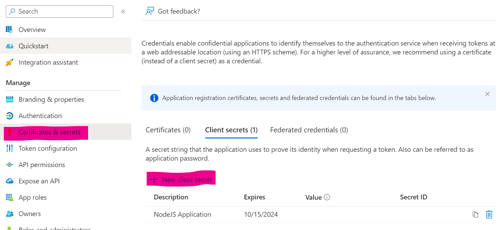

# Step-by-Step Write Up of Implementation

## 0. Azure Entra App Registration

### M365 Dev Environment

Sign up for the Microsoft 365 developer environment if you're eligible. You won't have access to Azure directly, but you'll still get access to Entra (Active Directory).
<https://learn.microsoft.com/en-us/office/developer-program/microsoft-365-developer-program-get-started>

Otherwise, use your Azure account, but beware of risks of developing in your production environment.

### App Registration with Microsoft Entra

Start a new App Registration.

Depending whether you're using Azure's Entra or M365 Entra (through Dev environment), the location of the app registration section is different.

### Azure App Registration (Production Environment)

Navigate to [Microsoft Entra ID](https://portal.azure.com/#view/Microsoft_AAD_IAM/ActiveDirectoryMenuBlade/~/RegisteredApps) and find App Registration within side menu.

### M365 Entra (Dev Environment)

Navigate to [Microsoft Entra admin center](https://entra.microsoft.com/#view/Microsoft_AAD_RegisteredApps/ApplicationsListBlade/quickStartType~/null/sourceType/Microsoft_AAD_IAM) and find App registration under Applications dropdown in side menu.

### App Registration

Steps to register an application are the same regardless of M365 Entra or Azure environment.

1. Start a new Registration.
1. Name the application, select the support account type that applies to you. For internal organization use, select the first option. This restricts login access to only this user directory.
1. Enter the Redirect URI `{domain/localhost}/api/v1/auth/callback`. `HTTP` and `localhost` for development, or use `HTTPS` and domain for production.

### App Certifications & Secrets

1. Within App Registration, navigate to Certifications & Secrets then new Client Secret.
1. Enter a name and expiry date.
1. Copy Client Secret, as this is the only time you'll see it.
1. Paste it within your secret management process, for `AZURE_CLIENT_SECRET`.
See the Secrets section of project [Readme](../../README.md).

### API Permissions - Scope

1. Within the API Permissions section, click Add Permission.
1. Choose Microsoft Graph, then Delegated Permissions.
1. Search and add for each Scope listed within [appConfig.json](appConfig.json) file. E.g. `User.Read` etc.
1. Back on the listed Configured Permissions, click Grant admin consent for MSFT.

### Copy Tenant and Client ID

1. Navigate back to Overview page of app registration.
1. Copy the Application (client) ID and Directory (tenant) ID, and paste into secrets management for `AZURE_CLIENT_ID` and `AZURE_TENANT_ID`.
See the Secrets section of project [Readme](../../README.md).

## 1. Microsoft OAuth2 (MSAL) Flow and Test Graph Call

See the [#01-Setup-MSAL-and-Testing-Graph](https://github.com/nickjfrench/ms-automation-graph-nestjs/tree/01-Setup-MSAL-and-Testing-Graph) branch.

// Explain the OAuth2.0 Flow.

Now we have Azure Entra app registration configured, we can use it to perform an OAuth2.0 flow.
There are plenty of guides on the internet explaining how OAuth2.0 works, so I won't go into detail.

We're using the MSAL for NodeJS library for OAuth2.0 flow, as it abstracts a lot of the technical details required with an alternative method like Passport.

The basics for how it's implemented within this project are:

1. Use an NestJS AuthGuard to perform a check on a protected endpoint (e.g. /user). This checks the user's session for a token.
1. If no token, raise an UnauthorizedException. This is picked up by a custom NestJS UnauthorizedException filter.
1. Save the original request url (/user) within session.
1. Redirect the user to Microsoft for authorization. This link is built with a standard login with the Tenant ID appended:
`https://login.microsoftonline.com/AZURE_TENANT_ID`
1. As Entra knows our redirect URI, it sends the client back to that endpoint with the code appended (/auth/callback?code=xxxxx).
1. The Callback endpoint handles the redirection and uses the code to request an access token (handled by MSAL-Node library) along with the Client Secret.
1. The token is saved to the user's session and the original redirection URL is read from session.
1. User is then redirected to their original endpoint (/user).

// Auth Service, Controller, and Module

// Session Management - Extending Session Type, Token and Redirect URL

// Auth Guard

// Unauthorized Exception Filter

// User Profile and Graph Call with Token
